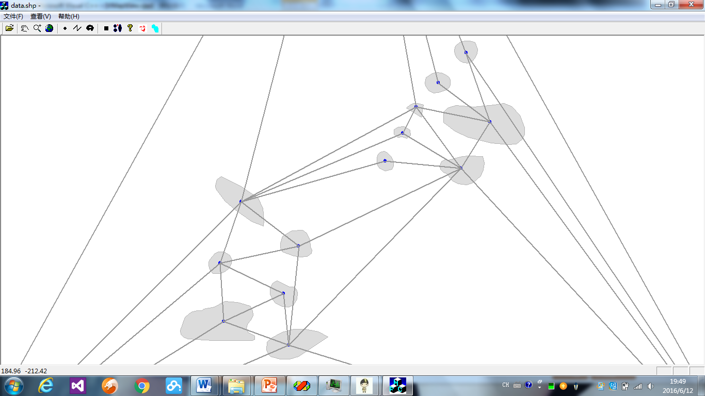
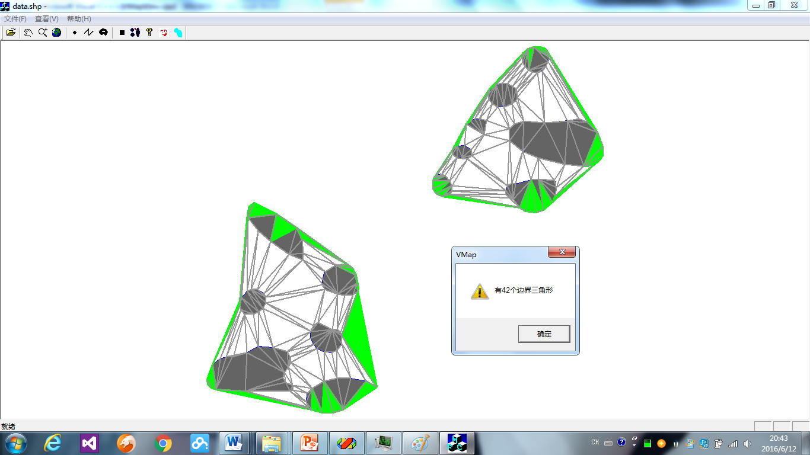
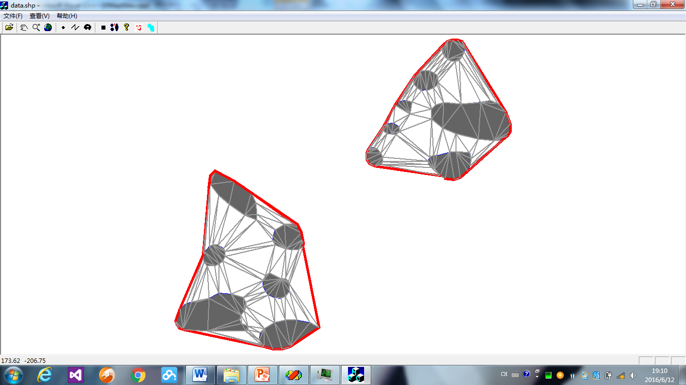
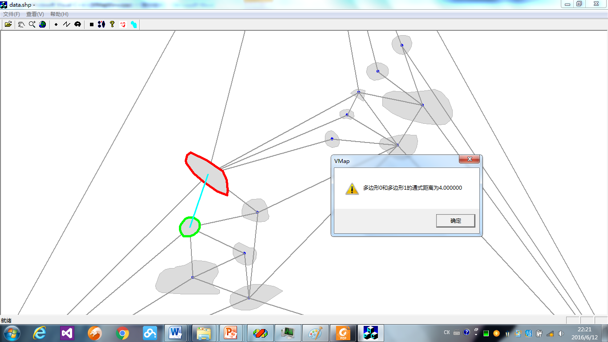
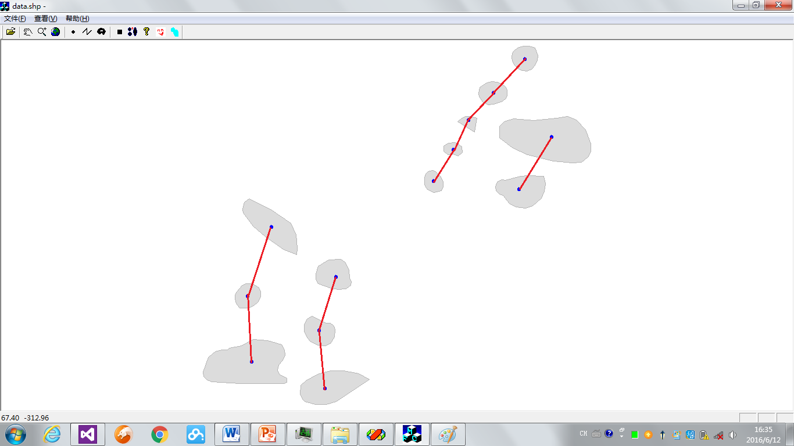

# map-automation
General Explainations

This is a bachelor exercise.

The main task is to group closer objects using Delaunay Triangulation. Main functions in VMapView.cpp
1. Generate triangulation from the center point of each object

2. Group the objects based on the distance in the triangulation.

3. Paint the boundaries of different groups

4. Calculate the distance between groups by treating each group as polygon and determine the polygon distance using average height of triangles in between

5. Use Gestalt rule (proximity and continuity), to detect the spatial distribution pattern.  Detect the angles of the lines to neighboring centers, the continuity is satisfied when the angle is between 120 deg - 180 deg

